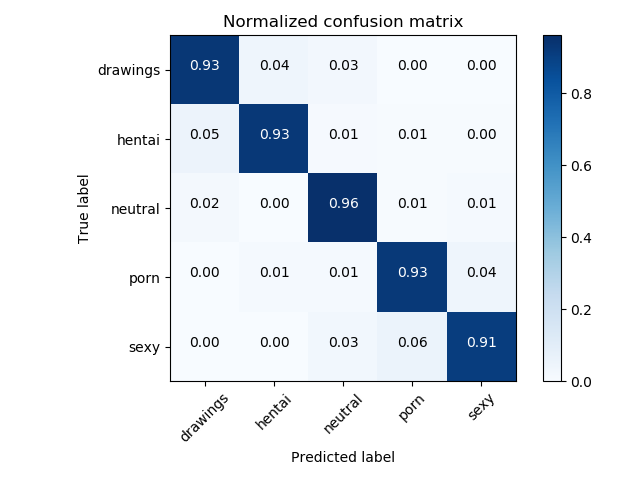

# NSFW Detection Machine Learning Model

Trained on 60+ Gigs of data to identify:
- `drawings` - safe for work drawings (including anime)
- `hentai` - hentai and pornographic drawings
- `neutral` - safe for work neutral images
- `porn` - pornographic images, sexual acts
- `sexy` - sexually explicit images, not pornography

## Current Status:

93% Accuracy with the following confusion matrix, based on Inception V3.

## Requirements:

See [requirements.txt](requirements.txt).